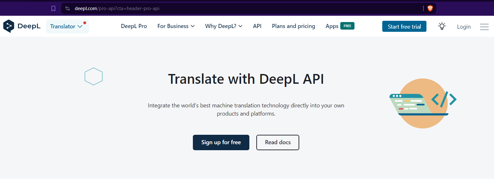
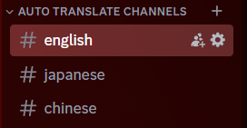
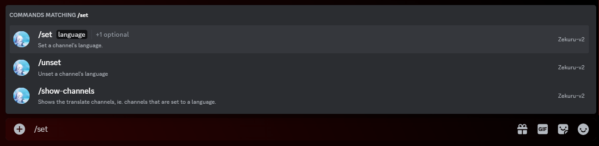
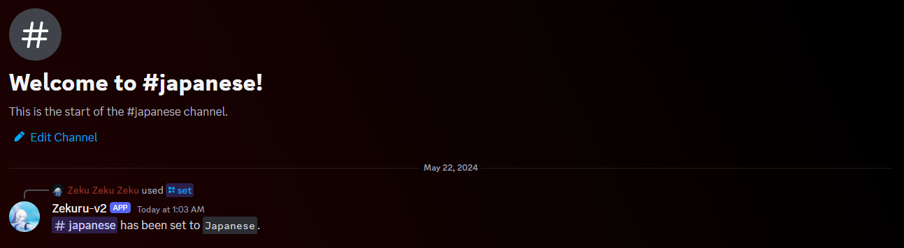
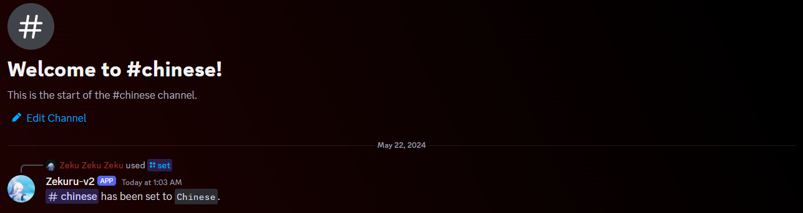
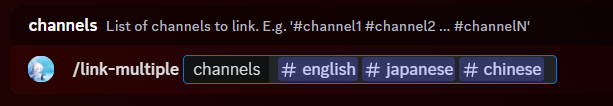
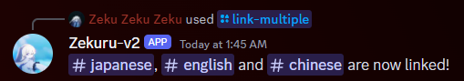

import DiscordInviteLink from '@site/src/components/DiscordInviteLink.tsx'

# Adding Zekuru-v2 to your server

To start using Zekuru-v2, invite the bot to your awesome server!

<DiscordInviteLink
  imageSrc="https://cdn.discordapp.com/avatars/1161611086139768862/0ccde9bc440e0929a0c83734c928afda.webp?size=96"
  imageAlt="Zekuru-v2 bot picture"
  name="Zekuru-v2"
  link="https://discord.com/oauth2/authorize?client_id=1161611086139768862&permissions=137976212544&scope=bot+applications.commands"
/>

Once you have added Zekuru-v2, let's see how to set up translate channels and link them together to start chatting! But before that, we must first sign in using a Deepl API key.

:::info What's an API key?
An API key is used to access services of an application. In this case, we need to access the translation service of Deepl.
:::

:::info What's an API?
API stands for _"Application Programming Interface"_ and it is an interface which allows applications to talk with each other. In this case, Zekuru-v2 and the Deepl translation service.
:::

## Signing in

To get a Deepl API key, go to Deepl's website: https://www.deepl.com/. Navigate to **API** and click on the **Sign up for free** button.

You will be brought to a sign up page. Go create a new Deepl account, provide the necessary details to complete signing up for the Deepl API.

:::warning
You will be asked by Deepl to **provide payment information**, they do this to prevent misuse of their services like creating multiple accounts to get unlimited characters. Rest assured that you **won't be billed** unless you choose to get their Pro version of the API.

Unlimited characters? Deepl provides 500K free monthly characters to use for translation. They are a business and not a charity. To be honest with you, 500K characters is already **a lot**. Therefore, Zekuru-v2 is just a Discord wrapper around their translation service.
:::

Once you finished signing up for the free API, you should be brought to your Deepl account page. Go select **API Keys** and there you will see your Deepl API key!

Finally, copy your key, go back to your Discord server, and type the following command `/sign-in <your-api-key>`. You should now see the bot signed in on your server.

:::info Where does my API key go?
When you sign in, your API key will be encrypted with SHA256 algorithm, which is a very strong encryption algorithm, then it will be sent to the bot's database server.
:::

## Setting up translate channels

A channel that has a language set on it is called a **translate channel**.

1. Start by creating a new category called **Auto-Translate Channels**.

2. In this new category, create new channels that we will set languages for. In this example, we will be creating 3 channels: an **English** channel, a **Japanese** channel, and a **Chinese** channel.

3. Go to the **English** channel and type `/set`, options will appear, select the command of this bot.

4. In the language option, type _"English"_ then press enter. You will notice there's another option **channel**, ignore it and press enter again. The English channel should now be set to the **English** language.

5. Repeat 3 and 4 for both the Japanese and Chinese channels.

Congratulations! You have now created and set up three translate channels! But the work isn't done yet, we must link these channels before our messages can be translated.

## Linking translate channels

As the time of writing, there exist two linking commands `/link` and `/link-multiple`, since we want to link multiple channels, we obviously would want to use the `/link-multiple` command.

1. To link multiple channels, type, and **I mean type and not copy-paste**, the following command: `/link-multiple #english #japanese #chinese`. Make sure that it is similar to the image below.

2. Then press enter! You should receive the following message.

If you used the command inside of the translate channels, you should automatically receive the translated versions of the bot's response in the other channels. **How cool is that?!**

:::warning Pinging users will ping them in all channels!
It is up to you to tell your members not to ping carelessly, when someone pings another user, that message will be translated and sent to other translate channels along with the ping causing multiple pings on the user. **This is intended behaviour** because how else should the bot know which language channel the user being pinged to is staying? Zekuru-v2 doesn't read minds.
:::

## Other things to know

If you want to add a new translate channel, do the same steps as we did before but you might be interested to use the `/link` command with the `recursive` option to link it with all the other translate channels automatically.

For anything else such unlinking channels, unsetting channels, or signing out, please refer to the documentation on those commands which you can find on the sidebar on the left.
