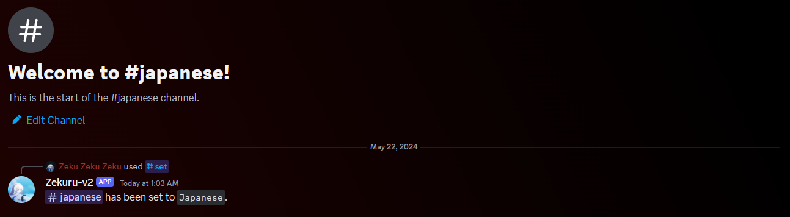

import DiscordInviteLink from '@site/src/components/DiscordInviteLink.tsx'

# Aggiungere Zekuru-v2 al tuo server

Per iniziare a utilizzare Zekuru-v2, invita il bot sul tuo fantastico server!

<DiscordInviteLink
  imageSrc="https://cdn.discordapp.com/avatars/1161611086139768862/0ccde9bc440e0929a0c83734c928afda.webp?size=96"
  imageAlt="immagine di profilo di Zekuru-v2"
  name="Zekuru-v2"
  link="https://discord.com/oauth2/authorize?client_id=1161611086139768862&permissions=137976212544&scope=bot+applications.commands"
/>

Una volta aggiunto Zekuru-v2, vediamo come configurare i canali di traduzione e collegarli per iniziare a chattare! Ma prima di questo, dobbiamo effettuare l'accesso utilizzando una chiave API di DeepL.

:::info Che cos'è una chiave di API?
Una chiave API viene utilizzata per accedere ai servizi di un'applicazione. In questo caso, dobbiamo accedere al servizio di traduzione di DeepL.
:::

:::info Che cos'è un API?
API sta per "Application Programming Interface" ed è un'interfaccia che consente alle applicazioni di comunicare tra loro. In questo caso, Zekuru-v2 e il servizio di traduzione DeepL.
:::

## Accedere a Zekuru-v2

Per ottenere una chiave API di DeepL, visita il sito web di DeepL: https://www.deepl.com/. Vai su **API** e clicca sul pulsante **Sign up for free**.

Verrai indirizzato a una pagina di registrazione. Crea un nuovo account DeepL e fornisci i dettagli necessari per completare la registrazione all'API di DeepL.

:::warning
DeepL ti chiederà di **fornire le informazioni di pagamento**. Lo fanno per prevenire l'abuso dei loro servizi, come la creazione di più account per ottenere caratteri illimitati. Stai tranquillo, **non ti verrà addebitato alcun costo** a meno che tu non scelga di ottenere la versione Pro dell'API.

Caratteri illimitati? DeepL offre 500.000 caratteri mensili gratuiti da utilizzare per la traduzione. Sono un'azienda e non un ente di beneficenza. A dir la verità, 500.000 caratteri sono già **tantissimi**. Pertanto, Zekuru-v2 è solo un wrapper Discord per il loro servizio di traduzione.
:::

Una volta completata la registrazione per l'API gratuita, dovresti essere indirizzato alla pagina del tuo account DeepL. Seleziona **API keys** e lì vedrai la tua chiave API di DeepL!

Infine, copia la tua chiave, torna al tuo server Discord e digita il seguente comando: `/sign-in <your-api-key>`. Dovresti ora vedere il bot collegato sul tuo server.

:::info Dove finisce la mia chiave API?
Quando accedi, la tua chiave API verrà crittografata con l'algoritmo SHA256, che è un algoritmo di crittografia molto forte, e verrà poi inviata al server del database del bot.
:::

## Impostazione dei canali di traduzione

Un canale con una lingua impostata viene chiamato **canale di traduzione**.

1. Inizia creando una nuova categoria chiamata **Auto-Translate Channels** cioè _canali di traduzione automatica_.

2. In questa nuova categoria, crea nuovi canali per i quali imposteremo le lingue. In questo esempio, creeremo 3 canali: un canale in inglese, un canale in giapponese e un canale in cinese.

3. Vai al canale di inglese e digita `/set`, appariranno le opzioni, seleziona il comando di questo bot.

4. Nell'opzione _language_, digita "English" e poi premi invio. Noterai che c'è un'altra opzione canale, ignorala e premi nuovamente invio. Il canale di inglese dovrebbe ora essere impostato sulla lingua inglese.

5. Ripeti i punti 3 e 4 per entrambi i canali giapponese e cinese.

Complimenti! Ora hai creato e configurato tre canali di traduzione! Ma il lavoro non è finito, dobbiamo collegare questi canali prima che i nostri messaggi possano essere tradotti.

## Collegamento dei canali di traduzione

Esistono due comandi di collegamento: `/link` e `/link-multiple`. Dato che vogliamo collegare più canali contemporaneamente, useremo ovviamente il comando `/link-multiple`.

1. Per collegare più canali, digita (non copiare e incollare) il seguente comando: `/link-multiple #english #japanese #chinese`. Assicurati che sia simile all'immagine seguente.

2. Premi invio! Dovresti ricevere il seguente messaggio:

Se hai usato il comando all'interno dei canali di traduzione, dovresti ricevere automaticamente le versioni tradotte della risposta del bot negli altri canali. **Fantastico, vero?**

:::warning Pingare gli utenti li notificherà in tutti i canali!
Sta a te informare i tuoi membri di pingare o menzionare altri utenti con leggerezza. Quando qualcuno pinga un altro utente, quel messaggio verrà tradotto e inviato agli altri canali di traduzione insieme il ping, causando notifiche multiple all'utente. **Questo è un comportamento voluto** perché in che altro modo il bot dovrebbe sapere in quale canale di traduzione si trova l'utente menzionato?
:::

## Altre cose da sapere

Se vuoi aggiungere un nuovo canale di traduzione, segui gli stessi passaggi di prima, ma potresti essere interessato a usare il comando `/link` con l'opzione `recursive` per collegarlo automaticamente a tutti gli altri canali di traduzione.

Per qualsiasi altra operazione, come scollegare canali, rimuovere la lingua impostata su un canale o disconnetterti, consulta la documentazione relativa a quei comandi che puoi trovare nella barra laterale a sinistra.
