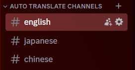

import DiscordInviteLink from '@site/src/components/DiscordInviteLink.tsx'

# あなたのサーバーに Zekuru-v2 を追加する

Zekuru-v2 を使い始めるには、素晴らしいサーバーにボットを招待しましょう!

<DiscordInviteLink
  imageSrc="https://cdn.discordapp.com/avatars/1161611086139768862/0ccde9bc440e0929a0c83734c928afda.webp?size=96"
  imageAlt="Zekuru-v2 画像"
  name="Zekuru-v2"
  link="https://discord.com/oauth2/authorize?client_id=1161611086139768862&permissions=137976212544&scope=bot+applications.commands"
/>

Zekuru-v2 を追加したら、翻訳チャンネルを設定してリンクし、チャットを開始してみましょう! その前に、Deepl API キーを使用してサインインする必要があります。

:::info API キーとは？
API キーは、アプリケーションのサービスにアクセスするために使用されます。 この場合、Deepl の翻訳サービスにアクセスする必要があります。
:::

:::info API とは？
API は「Application Programming Interface」の略で、アプリケーション同士が通信するためのインターフェースです。 この場合、Zekuru-v2 と Deepl の翻訳サービスがやり取りを行います。
:::

## サインイン

Deepl API キーを取得するには、Deepl のウェブサイトにアクセスしてください: [https://www.deepl.com/](https://www.deepl.com/)。**API** に移動し、 **無料登録** ボタンをクリックします。

Deepl アカウントの登録ページに移動します。 新しい Deepl アカウントを作成し、必要事項を入力して Deepl API の登録を完了してください。

:::warning
Deepl は、複数のアカウントを作成して無制限の文字数を取得するような悪用を防ぐため、支払い情報の入力を求めてきます。ただし、Pro 版の API を選択しない限り、課金されることはありません。

無制限の文字数？ Deepl は無料で毎月 50 万文字の翻訳を提供しています。 彼らはビジネスであり、慈善団体ではありません。 正直に言うと、50 万文字というのはすでに**非常に多量**です。 そのため、Zekuru-v2 は Deepl の翻訳サービスを Discord 上で利用するためのラッパーにすぎません。
:::

無料 API の登録が完了したら、Deepl アカウントページが表示されます。 **API キー** を選択すると、Deepl API キーが表示されます!

Deepl API キーをコピーし、Discord サーバーに戻り、次のコマンドを入力してください: `/sign-in <あなたの API キー>`. サーバー上でボットがサインインしていることを確認できるはずです。

:::info API キーはどこに保存されますか？
サインインすると、API キーは SHA256 アルゴリズム (非常に強力な暗号化アルゴリズム) で暗号化され、ボットのデータベースサーバーに送信されます。
:::

## 翻訳チャンネルの設定

言語が設定されているチャンネルは、**翻訳チャンネル**と呼ばれます。

1. まず、**自動翻訳チャンネル**という新しいカテゴリを作成します。

2. この新しいカテゴリ内で、言語を設定する新しいチャンネルを作成します。 この例では、**英語**、**日本語**、**中国語**の 3 つのチャンネルを作成します。

3. **英語** チャンネルに行き、 `/set` と入力します。 ボットのコマンドが表示されるので、選択します。

4. 言語オプションで「**英語**」を入力し、Enter キーを押します。 もう 1 つの **チャンネル** オプションがあることに気づくでしょうが、それを無視してもう一度 Enter キーを押します。 英語チャンネルが **英語** 言語に設定されるはずです。

5. 日本語と中国語のチャンネルについても 3 と 4 を繰り返します。

おめでとうございます! 3つの翻訳チャンネルを作成して設定しました! ただし、メッセージが翻訳されるようにするには、これらのチャンネルをリンクする必要があります。

## 翻訳チャンネルのリンク

執筆時点では、`/link` と `/link-multiple` の 2 つのリンク コマンドが存在します。 複数のチャンネルをリンクしたいので、もちろん `/link-multiple` コマンドを使用します。

1. 複数のチャンネルをリンクするには、 **コピーではなく入力** で、以下のコマンドを入力してください: `/link-multiple #english #japanese #chinese`。 以下の画像のようになっていることを確認してください。

2. その後、Enter キーを押してください! 以下のメッセージが表示されるはずです。

翻訳チャンネル内でコマンドを使用した場合は、他のチャンネルで自動的にボットのレスポンスの翻訳バージョンを受信するはずです。 **なんてクールなんでしょう!**

:::warning ユーザーを ping すると、すべてのチャンネルで ping されます! 
メンバーに注意せずに ping しないように伝えてください。 誰かが別のユーザーを ping すると、そのメッセージは翻訳され、他の翻訳チャンネルに ping 通知とともに送信され、ユーザーが ping 通知を複数回受け取るようになります。 **これは意図された動作です。** なぜなら、ボットは ping されたユーザーがどの言語チャンネルにいるのかを他に知る方法がないからです。 Zekuru-v2 は心を読み取ることはできません。
:::

## その他の注意事項

新しい翻訳チャンネルを追加したい場合は、以前と同じ手順で行ってください。 ただし、`/link` コマンドと `recursive` オプションを組み合わせて使用すると、他のすべての翻訳チャンネルと自動的にリンクすることができるので、興味があるかもしれません。

チャンネルのリンク解除、チャンネルの解除設定、サインアウトなどについては、左側のサイドバーにあるこれらのコマンドに関するドキュメントを参照してください。